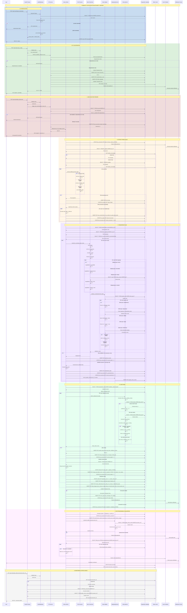

```mermaid
sequenceDiagram
    participant User
    participant API as FastAPI Routes
    participant Auth as AuthMiddleware
    participant Service as ETLService
    participant Celery as Celery Worker
    participant Processor as File Processor
    participant Transformer as Data Transformer
    participant Validator as Data Validator
    participant DQ as DataQualityService
    participant Matcher as Entity Matcher
    participant DB as PostgreSQL Database
    participant Cache as Redis Cache
    participant Events as Event Publisher
    participant Notif as Notification Service

    Note over User,Notif: Complete ETL Job Execution Flow with FastAPI + SQLModel

    %% Authentication Phase
    rect rgb(200, 220, 240)
        Note over User,Auth: 1. AUTHENTICATION
        User->>API: POST /api/v1/auth/login (credentials)
        API->>Auth: Verify JWT token
        Auth->>DB: SELECT * FROM users WHERE username=?
        DB-->>Auth: User record
        Auth->>Auth: bcrypt.verify(password)
        alt Invalid credentials
            Auth-->>API: 401 Unauthorized
            API-->>User: Authentication failed
        else Valid credentials
            Auth->>Auth: jwt.encode(user_id, secret)
            Auth-->>API: access_token + refresh_token
            API->>DB: UPDATE users SET last_login=NOW()
            API-->>User: 200 OK + tokens
        end
    end

    %% Job Creation Phase
    rect rgb(220, 240, 220)
        Note over User,DB: 2. ETL JOB CREATION
        User->>API: POST /api/v1/jobs (job_config)
        API->>Auth: Validate token
        Auth-->>API: User authenticated
        API->>Service: create_etl_job(job_config, user_id)
        
        Service->>DB: Check job_dependencies
        DB-->>Service: Dependencies status
        
        alt Dependencies not met
            Service-->>API: 400 Bad Request
            API-->>User: Dependencies not satisfied
        else Dependencies met
            Service->>DB: BEGIN TRANSACTION
            Service->>DB: INSERT INTO etl_jobs VALUES(...)
            DB-->>Service: job_id
            
            Service->>DB: INSERT INTO transformation_rules
            Service->>DB: INSERT INTO field_mappings
            Service->>DB: COMMIT TRANSACTION
            
            Service->>Cache: SET job:{job_id} config
            Service->>Events: Publish JobCreatedEvent
            Events->>Notif: Send job created notification
            
            Service-->>API: job_id + config
            API-->>User: 201 Created + job details
        end
    end

    %% Job Execution Phase
    rect rgb(240, 220, 220)
        Note over User,Notif: 3. JOB EXECUTION TRIGGER
        User->>API: POST /api/v1/jobs/{job_id}/execute
        API->>Auth: Validate token
        Auth-->>API: Authorized
        API->>Service: trigger_job_execution(job_id, user_id)
        
        Service->>DB: SELECT * FROM etl_jobs WHERE id=?
        DB-->>Service: Job configuration
        
        Service->>DB: Check is_enabled AND dependencies
        alt Job disabled or dependencies not met
            Service-->>API: 400 Bad Request
            API-->>User: Cannot execute job
        else Ready to execute
            Service->>DB: INSERT INTO job_executions (status='pending')
            DB-->>Service: execution_id
            
            Service->>Celery: delay(execute_etl_job.apply_async)
            Celery-->>Service: Task ID
            
            Service-->>API: 202 Accepted + execution_id
            API-->>User: Job queued for execution
        end
    end

    %% Async ETL Execution
    rect rgb(255, 245, 230)
        Note over Celery,Notif: 4. EXTRACT PHASE (Async)
        Celery->>DB: UPDATE job_executions SET status='running', started_at=NOW()
        Celery->>Events: Publish JobStartedEvent
        Events->>Notif: Send job started notification
        
        Celery->>DB: SELECT * FROM file_registry WHERE job_id=?
        DB-->>Celery: File records
        
        Celery->>Cache: GET file:{file_id} metadata
        alt Cache hit
            Cache-->>Celery: File metadata
        else Cache miss
            Celery->>DB: SELECT * FROM file_registry
            DB-->>Celery: File metadata
            Celery->>Cache: SET file:{file_id} metadata
        end
        
        loop For each file
            Celery->>Processor: process_file(file_path, file_type)
            
            alt File type: CSV
                Processor->>Processor: pd.read_csv(file_path)
            else File type: Excel
                Processor->>Processor: pd.read_excel(file_path)
            else File type: JSON
                Processor->>Processor: json.load(file_path)
            end
            
            alt File processing error
                Processor-->>Celery: ProcessingError
                Celery->>DB: INSERT INTO error_logs
                Celery->>DB: UPDATE file_registry SET status='failed'
            else File processed successfully
                Processor-->>Celery: DataFrame with raw data
                
                loop For each row in DataFrame
                    Celery->>Celery: Calculate data_hash = md5(row)
                    Celery->>DB: INSERT INTO raw_records (file_id, row_number, raw_data, data_hash)
                end
                
                Celery->>DB: UPDATE file_registry SET status='processed'
                Celery->>DB: UPDATE job_executions SET records_extracted += count
            end
        end
    end

    %% Transform Phase
    rect rgb(240, 230, 255)
        Note over Celery,Notif: 5. TRANSFORM PHASE
        Celery->>DB: SELECT * FROM transformation_rules WHERE job_id=?
        DB-->>Celery: Transformation rules
        
        Celery->>DB: SELECT * FROM field_mappings WHERE rule_id=?
        DB-->>Celery: Field mappings
        
        Celery->>DB: SELECT * FROM raw_records WHERE is_processed=false
        DB-->>Celery: Raw records batch
        
        loop For each raw record
            Celery->>Transformer: transform_record(raw_data, rules)
            
            %% Data Cleansing
            Transformer->>Transformer: clean_data()
            Transformer->>Transformer: remove_whitespace()
            Transformer->>Transformer: normalize_case()
            Transformer->>Transformer: handle_null_values()
            
            %% Field Mapping
            loop For each field mapping
                alt Mapping type: direct
                    Transformer->>Transformer: target[field] = source[field]
                else Mapping type: calculated
                    Transformer->>Transformer: target[field] = eval(expression)
                else Mapping type: lookup
                    Transformer->>DB: SELECT value FROM lookup_values WHERE key=?
                    DB-->>Transformer: Lookup value
                    Transformer->>Transformer: target[field] = lookup_value
                else Mapping type: constant
                    Transformer->>Transformer: target[field] = constant_value
                end
            end
            
            %% Data Validation
            Transformer->>Validator: validate_record(transformed_data)
            Validator->>DB: SELECT * FROM quality_rules WHERE entity_type=?
            DB-->>Validator: Quality rules
            
            loop For each quality rule
                alt Rule type: completeness
                    Validator->>Validator: Check for null/empty values
                else Rule type: uniqueness
                    Validator->>DB: Check duplicate in standardized_data
                    DB-->>Validator: Duplicate check result
                else Rule type: validity
                    Validator->>Validator: regex.match(pattern, value)
                else Rule type: range
                    Validator->>Validator: Check min <= value <= max
                else Rule type: consistency
                    Validator->>DB: Check referential integrity
                    DB-->>Validator: Consistency result
                end
                
                alt Validation failed
                    Validator->>Validator: Add to validation_errors
                else Validation passed
                    Validator->>Validator: Increment pass_count
                end
            end
            
            Validator-->>Transformer: validation_result
            
            alt Has validation errors (severity: error)
                Transformer-->>Celery: ValidationError
                Celery->>DB: INSERT INTO rejected_records
                Celery->>DB: UPDATE job_executions SET records_failed += 1
            else Validation passed or warnings only
                Transformer-->>Celery: Transformed & validated data
                
                Celery->>Celery: Calculate data_hash
                Celery->>DB: INSERT INTO standardized_data
                Celery->>DB: UPDATE raw_records SET is_processed=true
                Celery->>DB: UPDATE job_executions SET records_transformed += 1
                
                %% Data Quality Results
                Celery->>DQ: record_quality_check(record_id, results)
                DQ->>DB: INSERT INTO quality_check_results
            end
        end
    end

    %% Load Phase
    rect rgb(230, 255, 240)
        Note over Celery,Notif: 6. LOAD PHASE
        Celery->>DB: SELECT * FROM standardized_data WHERE validation_status='passed'
        DB-->>Celery: Validated records
        
        Celery->>DB: BEGIN TRANSACTION
        
        loop For each validated record
            Celery->>Matcher: match_entity(record_data)
            
            %% Entity Matching
            Matcher->>Matcher: Calculate entity_hash = md5(key_fields)
            Matcher->>DB: SELECT * FROM entities WHERE data_hash=?
            
            alt Exact match found
                DB-->>Matcher: Existing entity_id
                Matcher->>Matcher: confidence_score = 1.0
            else No exact match
                Matcher->>DB: SELECT * FROM entities WHERE entity_type=?
                DB-->>Matcher: Similar entities
                
                Matcher->>Matcher: Calculate fuzzy similarity
                Matcher->>Matcher: levenshtein_distance(new, existing)
                
                alt Similarity > threshold (e.g., 0.85)
                    Matcher->>Matcher: confidence_score = similarity
                    Matcher->>Matcher: Mark as potential duplicate
                else No similar entity found
                    Matcher->>Matcher: New entity, confidence_score = 1.0
                end
            end
            
            Matcher-->>Celery: entity_match_result
            
            alt New entity
                Celery->>DB: INSERT INTO entities (entity_data, data_hash, confidence_score)
                DB-->>Celery: entity_id
                
                Celery->>DB: INSERT INTO data_lineage (source_id, target_id=entity_id)
                Celery->>DB: UPDATE job_executions SET records_loaded += 1
                
            else Update existing entity
                Celery->>DB: SELECT * FROM entities WHERE id=?
                DB-->>Celery: Current entity data
                
                Celery->>Celery: Merge data with conflict resolution
                Celery->>DB: UPDATE entities SET entity_data=?, updated_at=NOW()
                
                Celery->>DB: INSERT INTO change_logs (table_name, record_id, operation='UPDATE', old_values, new_values)
                Celery->>DB: UPDATE job_executions SET records_loaded += 1
                
            else Duplicate entity
                Celery->>DB: UPDATE entities SET duplicate_count += 1, master_entity_id=?
                Celery->>DB: INSERT INTO entity_relationships (type='duplicate_of')
            end
            
            %% Create entity relationships
            Celery->>DB: INSERT INTO entity_relationships (from_entity_id, to_entity_id, relationship_type)
            
            %% Audit trail
            Celery->>DB: INSERT INTO data_lineage (source_entity_id, target_entity_id, transformation_rule_id, job_execution_id)
        end
        
        Celery->>DB: COMMIT TRANSACTION
        
        alt Transaction failed
            Celery->>DB: ROLLBACK TRANSACTION
            Celery->>DB: INSERT INTO error_logs (error_message, error_details)
            Celery->>DB: UPDATE job_executions SET status='failed'
            Celery->>Events: Publish JobFailedEvent
            Events->>Notif: Send failure notification
        else Transaction success
            Celery->>DB: UPDATE job_executions SET status='completed', completed_at=NOW()
        end
    end

    %% Post-processing Phase
    rect rgb(255, 240, 255)
        Note over Celery,Notif: 7. POST-PROCESSING & FINALIZATION
        
        %% Calculate metrics
        Celery->>DB: Calculate duration = completed_at - started_at
        Celery->>DB: UPDATE job_executions SET duration_seconds=?
        
        %% Performance metrics
        Celery->>DB: INSERT INTO performance_metrics (execution_id, records_per_second, memory_usage)
        
        %% Data quality summary
        Celery->>DQ: generate_quality_report(execution_id)
        DQ->>DB: SELECT * FROM quality_check_results WHERE execution_id=?
        DB-->>DQ: Quality results
        DQ->>DQ: Calculate pass_rate, error_rate
        DQ-->>Celery: Quality summary
        
        alt Quality below threshold
            Celery->>Events: Publish DataQualityAlert
            Events->>Notif: Send quality alert
        end
        
        %% Trigger dependent jobs
        Celery->>DB: SELECT child_job_id FROM job_dependencies WHERE parent_job_id=?
        DB-->>Celery: Dependent jobs list
        
        loop For each dependent job
            Celery->>DB: Check all parent jobs completed
            alt All parents completed
                Celery->>Celery: trigger_job_execution(child_job_id)
            end
        end
        
        %% Send completion notification
        Celery->>Events: Publish JobCompletedEvent
        Events->>Notif: Send success notification
        Notif->>User: Email/Slack notification
        
        %% Update cache
        Celery->>Cache: DELETE job:{job_id} status
        Celery->>Cache: SET execution:{execution_id} summary
    end

    %% Monitoring Query
    rect rgb(245, 245, 245)
        Note over User,Cache: 8. MONITORING & STATUS CHECK
        User->>API: GET /api/v1/jobs/{job_id}/executions/{execution_id}
        API->>Auth: Validate token
        Auth-->>API: Authorized
        
        API->>Cache: GET execution:{execution_id}
        alt Cache hit
            Cache-->>API: Execution summary
        else Cache miss
            API->>DB: SELECT * FROM job_executions WHERE id=?
            DB-->>API: Execution details
            API->>DB: SELECT * FROM quality_check_results WHERE execution_id=?
            DB-->>API: Quality results
            API->>Cache: SET execution:{execution_id}
        end
        
        API-->>User: 200 OK + execution details
    end
```